# Jarkom-Modul-2-E08-2021

## Nomor 1
Luffy adalah seorang yang akan jadi Raja Bajak Laut. Demi membuat Luffy menjadi Raja Bajak Laut, Nami ingin membuat sebuah peta, bantu Nami untuk membuat peta berikut:


EniesLobby akan dijadikan sebagai DNS Master, Water7 akan dijadikan DNS Slave, dan Skypie akan digunakan sebagai Web Server. Terdapat 2 Client yaitu Loguetown, dan Alabasta. Semua node terhubung pada router Foosha, sehingga dapat mengakses internet.

**Pembahasan:**

Tambahkan beberapa node ethernet switch dan ubuntu, lalu buat hubungan antar node dan nama-nama dari node hingga seperti di soal.

Lalu kita setting network masing-masing node dengan fitur `Edit network configuration`, kita bisa menghapus semua settingnya dan mengisi dengan settingan di bawah
  - Foosha
  ```
  auto eth0
  iface eth0 inet dhcp

  auto eth1
  iface eth1 inet static
  	address 10.33.1.1
  	netmask 255.255.255.0

  auto eth2
  iface eth2 inet static
  	address 10.33.2.1
  	netmask 255.255.255.0
  ```
  - Loguetown
  ```
  auto eth0
  iface eth0 inet static
  	address 10.33.1.2
  	netmask 255.255.255.0
  	gateway 10.33.1.1
  ```
  - Alabasta
  ```
  auto eth0
  iface eth0 inet static
  	address 10.33.1.3
  	netmask 255.255.255.0
  	gateway 10.33.1.1
  ```
  - EniesLobby
  ```
  auto eth0
  iface eth0 inet static
  	address 10.33.2.2
  	netmask 255.255.255.0
  	gateway 10.33.2.1
  ```
  - Water7
  ```
  auto eth0
  iface eth0 inet static
  	address 10.33.2.3
  	netmask 255.255.255.0
  	gateway 10.33.2.1
  ```
  - Skypie
  ```
  auto eth0
  iface eth0 inet static
  	address 10.33.2.4
  	netmask 255.255.255.0
  	gateway 10.33.2.1
  ```

Selanjutnya sambungkan semua node ke internet dengan perintah berikut:

- Pada Foosha: 

`iptables -t nat -A POSTROUTING -o eth0 -j MASQUERADE -s 10.33.0.0/16`

- Pada node-node lain:

`echo nameserver 192.168.122.1 > /etc/resolv.conf`


## Nomor 2
Luffy ingin menghubungi Franky yang berada di EniesLobby dengan denden mushi. Kalian diminta Luffy untuk membuat website utama dengan mengakses franky.yyy.com dengan alias www.franky.yyy.com pada folder kaizoku.

**Pembahasan:**

**Pada EniesLobby**

1. Install bind9

     `apt-get update`

     `apt-get install bind9 -y`

2. Ubah file named.conf.local dengan perintah 
   
   `nano /etc/bind/named.conf.local` 
   
   menjadi sebagai berikut:

     ```
     zone "franky.E08.com" {
          type master;
          file "/etc/bind/kaizoku/franky.E08.com";
     };
     ```

3. Buat folder kaizoku dengan perintah berikut: 
   
   `mkdir /etc/bind/kaizoku`
   
4. Copy file dengan perintah:
   
   `cp /etc/bind/db.local /etc/bind/kaizoku/franky.E08.com`

5. Ubah file `franky.E08.com` dengan perintah
   
   `nano /etc/bind/kaizoku/franky.E08.com`

   menjadi sebagai berikut:

   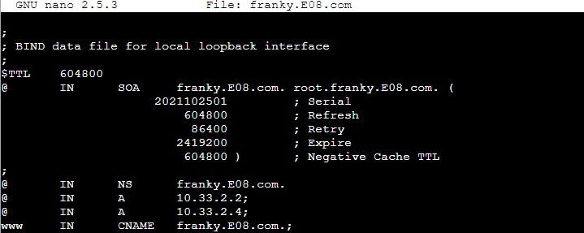

6. Restart bind9
   
   `service bind9 restart`

**Pada LogueTown dan Alabasta**

1. Tambahkan IP Enieslobbby `nameserver 10.33.2.2` pada file `/etc/resolv.conf`
2. Ping dan lakukan pengecekan host dari CNAME
   
   `ping franky.E08.com`

   `host -t CNAME www.franky.E08.com`
   
   `ping www.franky.E08.com`

   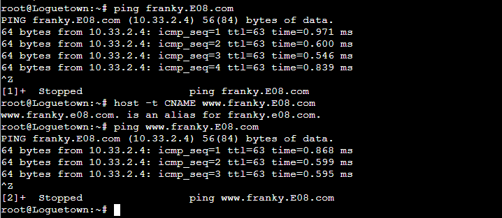


## Nomor 3
Setelah itu buat subdomain super.franky.yyy.com dengan alias www.super.franky.yyy.com yang diatur DNS nya di EniesLobby dan mengarah ke Skypie.

**Pembahasan:**

**Pada EniesLobby**

1. Ubah file `franky.E08.com` dengan perintah
   
   `nano /etc/bind/kaizoku/franky.E08.com`

   menjadi sebagai berikut:

   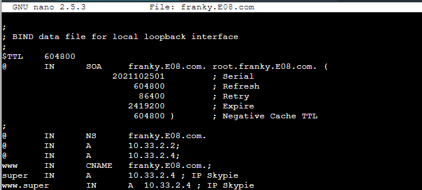

2. Restart bind9
   
   `service bind9 restart`

**Pada LogueTown dan Alabasta:**
1. Ping dan lakukan pengecekan host dari CNAME
   
   `ping super.franky.E08.com`

   `host -t A super.franky.E08.com`
   
   `ping www.super.franky.E08.com`

   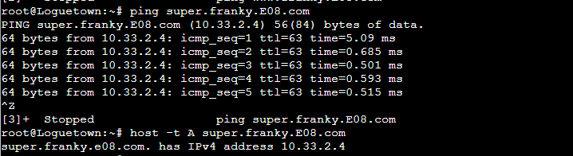

## Nomor 4
Buat juga reverse domain untuk domain utama.

1. Ubah file named.conf.local dengan perintah 
   
   `nano /etc/bind/named.conf.local` 
   
   tambahkan konfigurasi berikut:

     ```
     zone "2.33.10.in-addr.arpa" {
          type master;
          file "/etc/bind/kaizoku/2.33.10.in-addr.arpa";
     };
     ```

     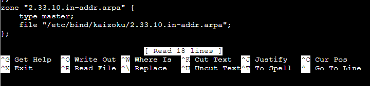
   
2. Copy file dengan perintah:
   
   `cp /etc/bind/db.local /etc/bind/kaizoku/2.33.10.in-addr.arpa`

3. Ubah file `2.33.10.in-addr.arpa` dengan perintah
   
   `nano /etc/bind/kaizoku/2.33.10.in-addr.arpa`

   menjadi sebagai berikut:

   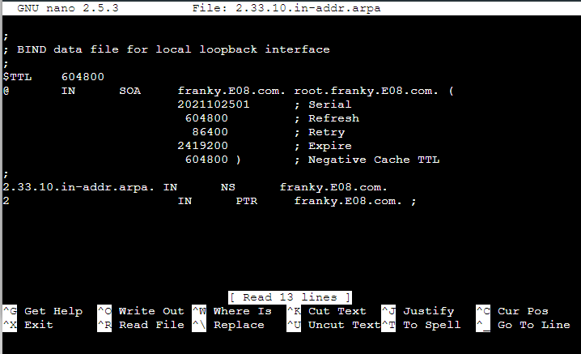

4. Restart bind9
   
   `service bind9 restart`

**Pada LogueTown dan Alabasta**

1. Lakukan pengecekan host PTR
   
   `host -t PTR 10.33.2.2`

   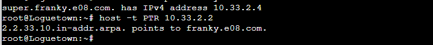

## Nomor 5
Supaya tetap bisa menghubungi Franky jika server EniesLobby rusak, maka buat Water7 sebagai DNS Slave untuk domain utama.

**Pembahasan:**

**Pada EniesLobby**

1. Ubah file named.conf.local dengan perintah 
   
   `nano /etc/bind/named.conf.local` 
   
   ubah konfigurasi pertama menjadi berikut:

     ```
     zone "franky.E08.com" {
          type master;
          notify yes;
          also-notify { 10.33.2.3; };
          allow-transfer { 10.33.2.3; }; 
          file "/etc/bind/kaizoku/franky.E08.com";
     };
     ```
     

2. Restart bind9
   
   `service bind9 restart`

**Pada Water7**

1. Ubah file named.conf.local dengan perintah 
   
   `nano /etc/bind/named.conf.local` 
   
   ubah konfigurasi pertama menjadi berikut:

     ```
     zone "franky.E08.com" {
         type slave;
         masters { 10.33.2.2; }; // Masukan IP EniesLobby tanpa tanda petik
         file "/var/lib/bind/franky.E08.com";
      };
     ```
     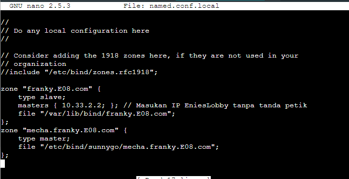

2. Restart bind9
   
   `service bind9 restart`

**Pada EniesLobby**

1. Stop bind9 service
     
    `service bind9 stop`

**Pada LogueTown dan Alabasta**

1. Tambahkan IP Water7 `nameserver 10.33.2.3` pada file `/etc/resolv.conf`
2. Ping `ping franky.E08.com`

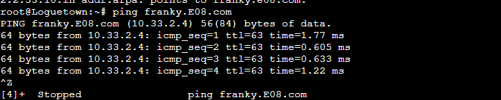

## Nomor 6
Setelah itu terdapat subdomain mecha.franky.yyy.com dengan alias www.mecha.franky.yyy.com yang didelegasikan dari EniesLobby ke Water7 dengan IP menuju ke Skypie dalam folder sunnygo.

**Pembahasan**

**Pada EniesLobby**
1. Ubah file `franky.E08.com` dengan perintah
   
   `nano /etc/bind/kaizoku/franky.E08.com`

   menjadi sebagai berikut:

   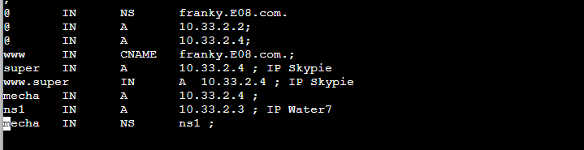

2. Ubah file `named.conf.options` dengan perintah
   
   `nano /etc/bind/named.conf.options`

   menjadi sebagai berikut:

   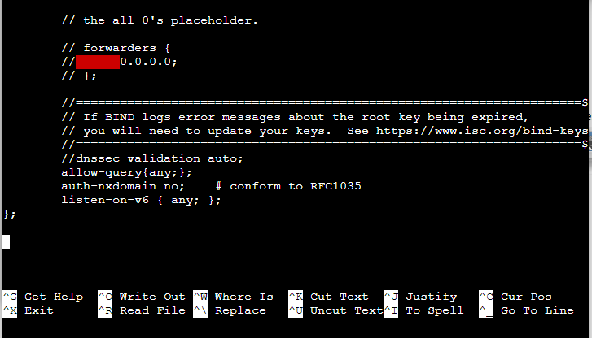

3. Restart bind9
   
   `service bind9 restart`

**Pada Water7**

1. Ubah file `named.conf.options` dengan perintah
   
   `nano /etc/bind/named.conf.options`

   menjadi sebagai berikut:

   

2. Ubah file `named.conf.local` dengan perintah
   
   `nano /etc/bind/named.conf.local`

   dengan menambahkan

   ```
   zone "mecha.franky.E08.com" {
          type master;
          file "/etc/bind/sunnygo/mecha.franky.E08.com";
     };
     ```

   menjadi sebagai berikut:

   

3. Buat folder kaizoku dengan perintah berikut: 
   
   `mkdir /etc/bind/sunnygo`
   
4. Copy file dengan perintah:
   
   `cp /etc/bind/db.local /etc/bind/sunnygo/mecha.franky.E08.com`


## Nomor 7
Untuk memperlancar komunikasi Luffy dan rekannya, dibuatkan subdomain melalui Water7 dengan nama general.mecha.franky.yyy.com dengan alias www.general.mecha.franky.yyy.com yang mengarah ke Skypie.

**Pada Water7**

1. Ubah file `mecha.franky.E08.com` dengan perintah
   
   `nano /etc/bind/sunnygo/mecha.franky.E08.com`

   menjadi sebagai berikut:

   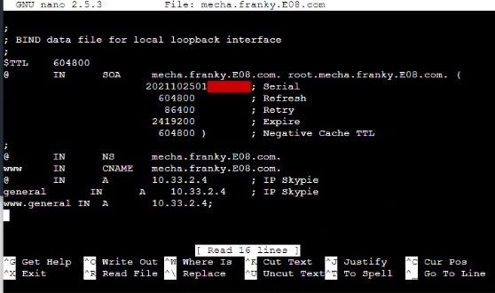

6. Restart bind9
   
   `service bind9 restart`

**Pada LogueTown dan Alabasta**

1. Ping 
   
   `ping mecha.franky.E08.com`
   
   `ping general.mecha.franky.E08.com`

   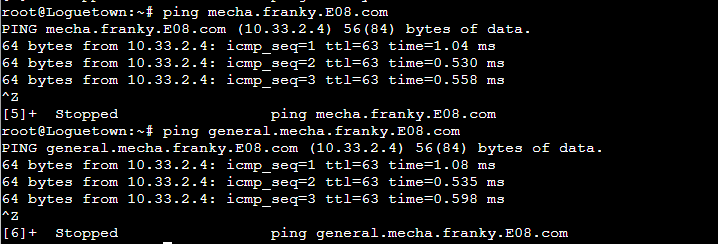

## Nomor 8


Setelah melakukan konfigurasi server, maka dilakukan konfigurasi Webserver. Pertama dengan webserver www.franky.yyy.com. Pertama, luffy membutuhkan webserver dengan DocumentRoot pada /var/www/franky.yyy.com.

Untuk melakukan konfigurasi server, pertama-tama pastikan bahwa Record A dan PTR sudah mengarah ke IP Skypie : 


Selanjutnya pindah ke Skypie dan lakukan instalasi php dan apache dengan command : 

```
apt-get install apache2 -y
apt-get install php -y
apt-get install libapache2-mod-php7.0 -y
```

Jangan lupa start apache dengan command :

`service apache2 start`

Setelah itu pindah directory ke `/etc/apache2/sites-available` untuk membuat config website franky dan gunakan command : 

`cp 000-default.conf franky.E08.com.conf`

Command tersebut untuk menyalin template yang ada di file `000-default.conf` ke file baru `franky.E08.com.conf`. Setelah itu buka file `franky.E08.com.conf`.
Ubah Document Root menjadi :

`DocumentRoot /var/www/franky.E08.com`

dan tambahkan :

```
ServerName franky.E08.com
ServerAlias www.franky.E08.com
```


Isi file sebagai berikut :


Setelah itu enable website dengan command :

`a2ensite franky.E08.com` dan restart apache dengan `service apache2 restart`.


Setelah itu kembali ke directory root dan download file `franky.zip` yang ada di link : [File Jarkom](https://github.com/FeinardSlim/Praktikum-Modul-2-Jarkom)


Setelah mendownload file digunakan command `wget <link hasil download>` untuk menaruh file `franky.zip` ke dalam Skypie. Sebelum meng-copy file yang ada di dalam `franky.zip` buatlah directory `franky.E08.com` di `/var/www` dengan command : 

`mkdir /var/www/franky.E08.com`

Setelah itu unzip file `franky.zip` dan copy file yang ada di dalam folder `franky` setelah di unzip ke directory `/var/www/franky.E08.com` dengan command :

```
cp /root/franky/home.html /var/www/franky.E08.com
cp /root/franky/index.php /var/www/franky.E08.com
```

Untuk checking apakah file tersebut berhasil di copy gunakan command `ls` di directory `/var/www/franky.E08.com` :


Konfigurasi website sudah selesai, untuk melakukan checking apakah web server tersebut berhasil kita pindah ke node Loguetown/Alabasta dan install Lynx dengan command :\

```
apt-get update
apt-get install lynx
```

Dan Cek website tersebut dengan command : 

`lynx franky.E08.com` dan `lynx www.franky.E08.com`

**Hasil** : 


## Nomor 9 


Setelah itu, Luffy juga membutuhkan agar url www.franky.yyy.com/index.php/home dapat menjadi menjadi www.franky.yyy.com/home. 


Pada Skypie pindah ke directory `/etc/apache2/sites-available` dan buka file `nano franky.E08.com.conf`.
Tambahkan di dalam file config tersebut : 

```
<Directory /var/www/franky.E08.com>
    Options +FollowSymLinks -Multiviews
    AllowOverride All
</Directory>
```

Isi file sebagai berikut :


Setelah itu gunakan command `a2enmod rewrite` untuk mengaktifkan module rewrite dan restart apache dengan command `service apache2 restart`.
Setelah itu pindah ke directory `/var/www/franky.E08.com` dan buat file `.htaccess` dengan command `nano .htaccess`. 
Tambahkan isi file tersebut dengan :

```
RewriteEngine On
RewriteCond %{REQUEST_FILENAME} !-d
RewriteRule ^home$ $index.php/home
```

Setelah itu cek apakah config untuk rewrite berhasil dengan mengakses website di Loguetown/Alabasta dengan command :

`lynx www.franky.E08.com/home`

**HASIL :**


## Nomor 10


Setelah itu, pada subdomain www.super.franky.yyy.com, Luffy membutuhkan penyimpanan aset yang memiliki DocumentRoot pada /var/www/super.franky.yyy.com.


Sama halnya dengan nomor 8, pindah ke directory `/etc/apache2/sites-available` untuk membuat config super.franky dan gunakan command : 

`cp 000-default.conf super.franky.E08.com.conf`


Setelah itu buka file `franky.E08.com.conf` dan ubah Document Root menjadi :

`DocumentRoot /var/www/super.franky.E08.com`


dan tambahkan :

```
ServerName super.franky.E08.com
ServerAlias www.super.franky.E08.com
```


Isi file sebagai berikut :


Setelah itu enable website dengan command :

`a2ensite super.franky.E08.com` dan restart apache dengan `service apache2 restart`.


Setelah itu kembali ke directory root dan download file `super.franky.zip` yang ada di link : [File Jarkom](https://github.com/FeinardSlim/Praktikum-Modul-2-Jarkom)


Setelah mendownload file digunakan command `wget <link hasil download>` untuk menaruh file `super.franky.zip` ke dalam Skypie. Sebelum meng-copy file yang ada di dalam `super.franky.zip` buatlah directory `super.franky.E08.com` di `/var/www` dengan command : 

`mkdir /var/www/super.franky.E08.com`


Setelah itu unzip file `super.franky.zip` dan copy file yang ada di dalam folder `super.franky` setelah di unzip ke directory `/var/www/super.franky.E08.com` dengan command :

```
cp -r /root/franky/error /var/www/super.franky.E08.com
cp -r /root/franky/public /var/www/super.franky.E08.com
```


Setelah itu cek di Loguetown/Alabasta dengan command:

`lynx super.franky.E08.com` dan `lynx www.super.franky.E08.com`


**HASIL:**


## Nomor 11


Akan tetapi, pada folder /public, Luffy ingin hanya dapat melakukan directory listing saja.


Pindah ke directory `/etc/apache2/sites-available` dan buka file `super.franky.E08.com.conf` dan tambahkan isi file sebagai berikut :


```
<Directory /var/www/super.franky.E08.com/public>
     Options +Indexes
</Directory>
```


Setelah itu restart apache dengan `service apache2 restart`.


Setelah itu cek di Loguetown/Alabasta dengan command:

`lynx super.franky.E08.com/public` dan `lynx www.super.franky.E08.com/public`


**HASIL:**


## Nomor 12


Tidak hanya itu, Luffy juga menyiapkan error file 404.html pada folder /error untuk mengganti error kode pada apache.


Pindah ke directory `/etc/apache2/sites-available` dan buka file `super.franky.E08.com.conf` dan tambahkan isi file sebagai berikut :

`ErrorDocument 404 /error/404.html`


Setelah itu restart apache dengan `service apache2 restart`.


Setelah itu cek di Loguetown/Alabasta dengan command:

`lynx super.franky.E08.com/bebaslur`


**HASIL:**


## Nomor 13


Luffy juga meminta Nami untuk dibuatkan konfigurasi virtual host. Virtual host ini bertujuan untuk dapat mengakses file asset www.super.franky.yyy.com/public/js menjadi www.super.franky.yyy.com/js.


Pindah ke directory `/etc/apache2/sites-available` dan buka file `super.franky.E08.com.conf` dan tambahkan isi file sebagai berikut :


```
<Directory /var/www/super.franky.E08.com/public/js>
     Options +Indexes
</Directory>
 
Alias "/js" "/var/www/super.franky.E08.com/public/js"
```


Setelah itu cek di Loguetown/Alabasta dengan command:

`lynx super.franky.E08.com/js`


**HASIL:**


